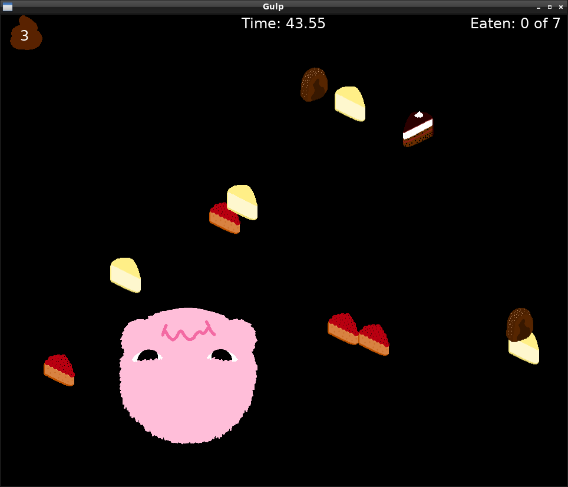

Gulp
====

Implemented during Ludum Dare 42 ("running out of shape").

This is a game about a hungry little plush monster that doesn't know too much cake is bad for it.
Thus you will need to guide him away from the cake, which happens to fall from the sky.
The tricky part is, the monster will grow whenever it eats a cake, which makes your mission harder each time.

How long will your monster survive?

Setup
=====

This software is implemented in Löve 2D version 11.1 (Mysterious Mysteries), which you will need to
install on your computer, and was only tested on Linux.

Clone the repository:

.. code-block::

	git clone https://github.com/Kjili/gulp.git

Change into the directory of your clone:

.. code-block::

	cd gulp

Run Love 2D:

.. code-block::

	love .

License
=======

This software is licensed under GPLv3.
